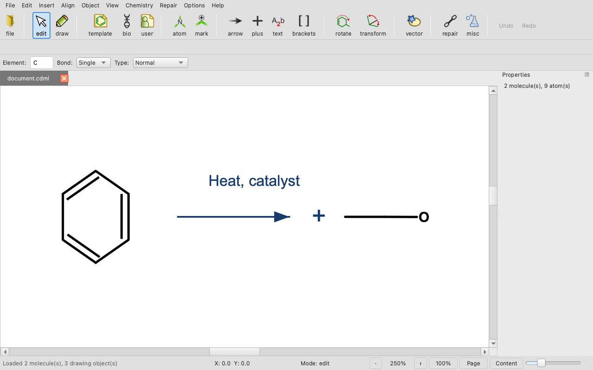
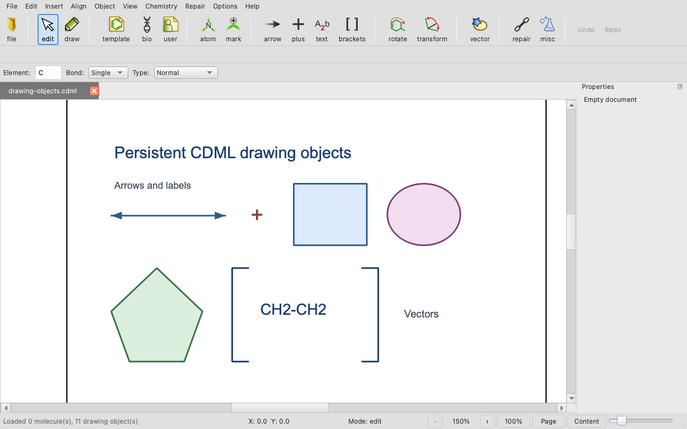
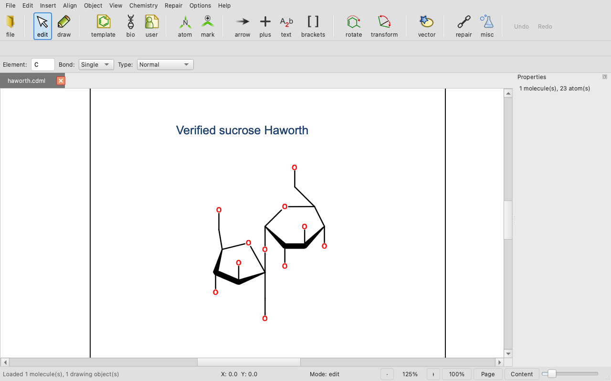

# BKChem capabilities

BKChem combines the OASA chemistry and document backend with the BKChem-Qt
editor. This page shows the current supported surface through reproducible views
of real native CDML sessions. The screenshots are application states, not visual
mockups.

## Visual tour

<!-- screenshots:begin (managed by screenshot-docs) -->



<!-- screenshots:end -->

### Complete molecular document

The first view mixes molecular structures with persistent presentation objects.
OASA owns their complete CDML order and content; Qt can discard and rebuild the
visible scene from the accepted backend snapshot.

### Persistent drawing objects

The second view shows that arrows, text, plus signs, shapes, and bracket polylines
are document records, not canvas-only decorations. They survive the same backend
round trip as molecules and remain addressable through durable IDs.

### Verified sucrose Haworth

The third view is generated from OASA's fixed PubChem CID 5988 source identity.
OASA validates that identity, constructs the
alpha-glucose/beta-fructose heavy-atom Haworth depiction, positions it as a
detached insertion proposal, and commits it through the normal document
transaction. Hydrogens remain implicit in this editable molecular view.

## Capability map

| Area | Current capability |
| --- | --- |
| Native document | Open, edit, save, reopen, and recover complete CDML 26.07 documents. |
| Molecular editing | Draw atoms and bonds, use templates, edit supported chemistry, and repair geometry. |
| Drawing objects | Persist arrows, rich text, plus signs, brackets, vectors, marks, groups, and ordering. |
| History | Apply persistent edits as atomic backend commits with undo, redo, dirty state, and saved-baseline tracking. |
| Chemistry helpers | Generate coordinates, insert Haworth sugars, create supported direct-glycosidic Haworth drawings, and perform user-requested PubChem lookup. |
| Import and export | Import the documented chemistry formats and export SVG, PNG, and PDF snapshots. |
| Application | Run the supported PySide6 desktop editor from a source or pip installation. |

The exact file-format boundaries are listed in
[SUPPORTED_FORMATS.md](SUPPORTED_FORMATS.md). [USAGE.md](USAGE.md) covers the
interactive workflows, while
[CDML_BACKEND_TO_FRONTEND_CONTRACT.md](CDML_BACKEND_TO_FRONTEND_CONTRACT.md)
defines why the visible Qt scene remains replaceable.

## Reproduce the gallery

Regenerate all three managed 1280x800 PNGs from the repository root:

```sh
source source_me.sh && ./take_qt_screenshot.sh --kill-after 3
```

Each scenario runs in a fresh bounded Qt process, opens complete CDML through the
public `MainWindow` path, verifies the backend snapshot, captures only the
application window, and retires its projection through the production lifetime
boundary. Capture one scenario to a preview under the retained repository
`tmp/` tree with:

```sh
source source_me.sh && ./take_qt_screenshot.sh \
  --scenario haworth --output tmp/haworth-preview.png --kill-after 3
```

The delivered application scope is the PySide6 frontend and Python OASA backend.
The retained Tk source is historical implementation evidence. A future Rust or
browser backend can consume the same ownership model without becoming a claim of
this release.
